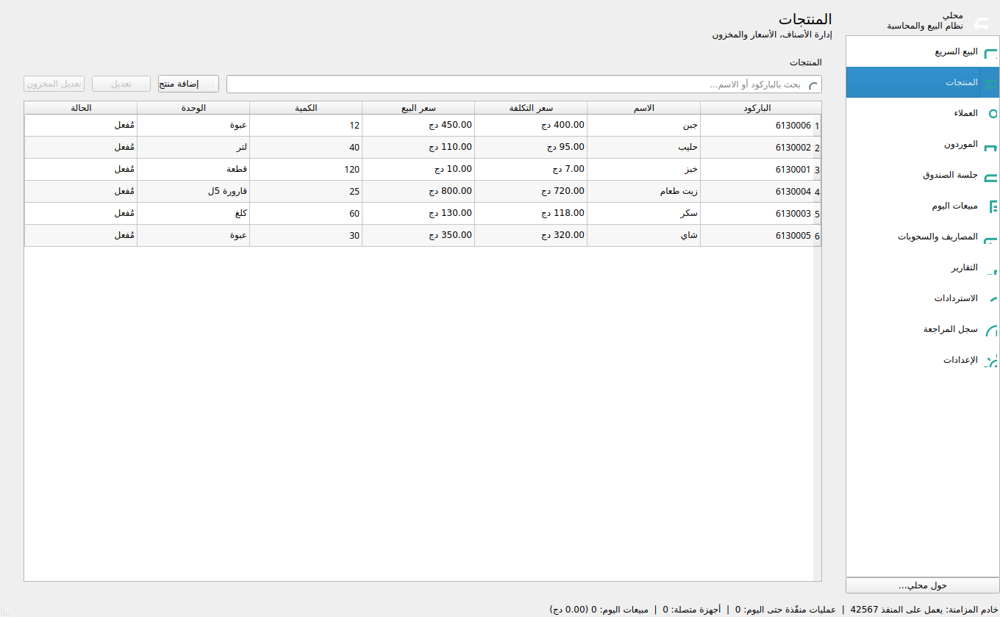
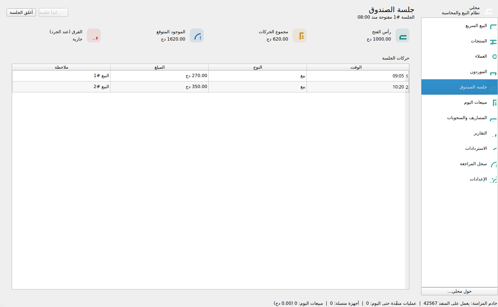
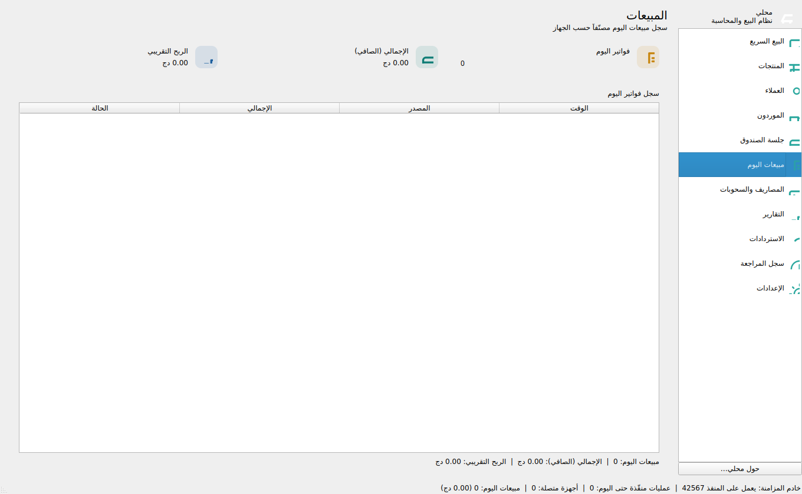
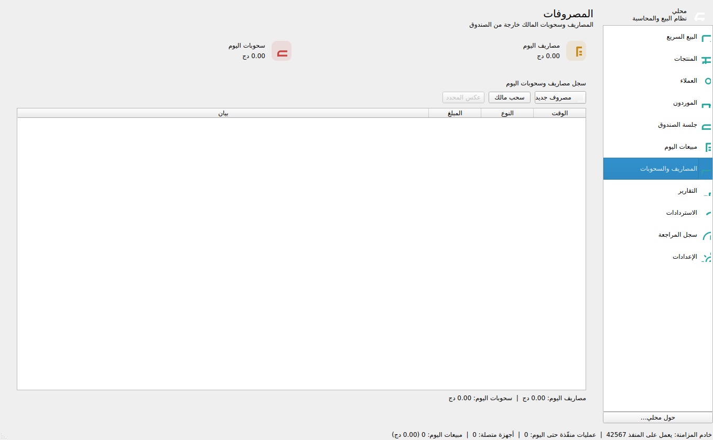
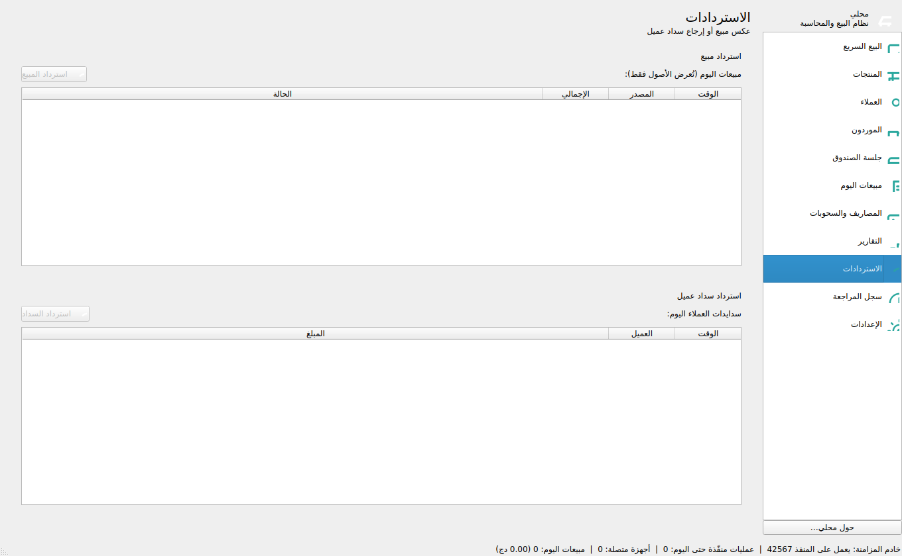
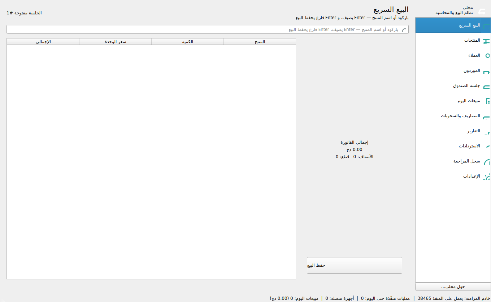
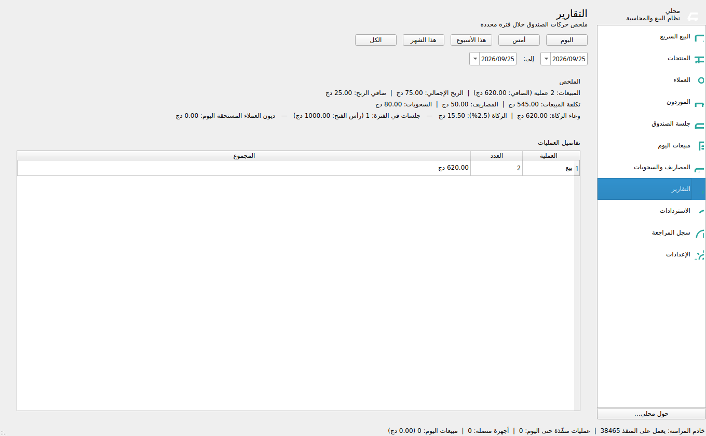
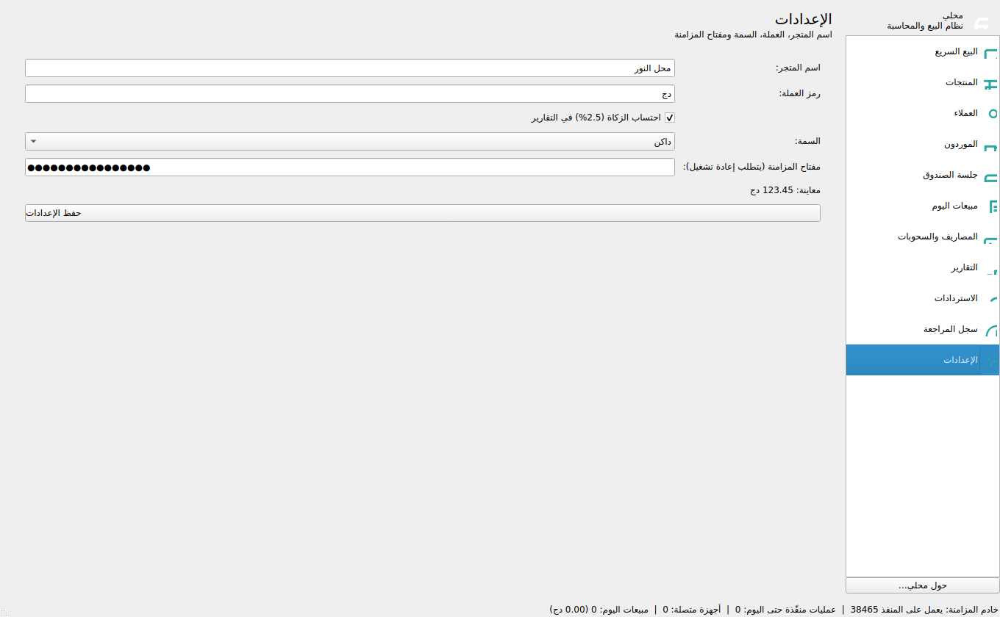

# محلي — نظام نقاط البيع والمحاسبة والمزامنة

نظام تجزي (مخزن/بقالة) يعمل دون اتصال، بواجهة عربية كاملة (RTL)، يدير
البيع السريع، الجرد، حسابات العملاء والموردين، جلسات الصندوق، المصاريف
والسحوبات، التقارير (الأرباح والزكاة)، الاستردادات، وسجل مراجعة كامل.

- **سطح المكتب**: محطة مركزية للبقالة (نقطة بيع + صندوق + إدارة).
- **أجهزة الطلب**: خطة لاحقة — جهاز يدوي يطلب ويشارك نفس طبقات
  البيانات والخدمات عبر مزامنة HMAC (البنية موجودة في `apps/android/`).

## المزايا

- بيع سريع بلوحة مفاتيح (تعديل الكمية/السعر بعد إضافة المنتج، وفرض سعر حرّ
  مع تسجيله في سجل المراجعة).
- جلسة صندوق يومية تفتح بمبلغ مبدئي وتغلق بالجرد والحساب والفرق.
- مبيعات آجلة للعملاء مع سداد، ومصاريف وسحوبات مع إمكانية عكس القيد.
- تقارير الأرباح/الخسارة والزكاة (2.5% من أساس الزكاة) قابلة للإيقاف.
- استرداد مبيع (يعيد الكميات للجرد ويقيد حركة صندوق عكسية) واسترداد سداد.
- خادم مزامنة مدمج (نقل عبر HTTP + طبقة HMAC) مع نسخة احتياطية WAL.
- سمتان (فاتح/داكن) تُبدَّلان من الإعدادات وتُحفظان، بواجهة بطاقات مسطحة
  وأيقونات مرسومة برمجياً — بدون أصول ثنائية إضافية.

## لقطات الشاشة

<div align="center">
  
  
  
  
  
  
  
  
</div>

### النمط الداكن

<div align="center">
  
  
  
</div>

## المتطلبات

- **Qt 6.4+** (وحدات `Core` و`Sql` و`Network` و`Widgets` و`HttpServer` و`Test`).
- **CMake 3.16+** ومولّد Ninja أو MinGW Makefiles.
- مترجم يدعم **C++17**.

## البناء على Windows

### 1) تثبيت Qt

- حمّل [Qt Online Installer](https://www.qt.io/download-open-source) وفعّل
  توزيعة **Desktop Qt 6.x MinGW 64-bit** (أو MSVC) — أو استخدم
  [aqtinstall](https://github.com/miurahr/aqtinstall) في سطر الأوامر:

  ```powershell
  pip install aqtinstall
  aqt install-qt windows desktop 6.7.2 win64_mingw
  ```

أضف مجلدات الأدوات إلى `PATH` (حسب مكان التثبيت) في كل جلسة أو من الإعدادات:

```powershell
$env:PATH = "C:\Qt\6.7.2\mingw_64\bin;C:\Qt\Tools\mingw1310_64\bin" + $env:PATH
```

### 2) البناء

```powershell
cmake -S . -B build -G Ninja -DCMAKE_BUILD_TYPE=Release
cmake --build build
```

أو بدون Ninja:

```powershell
cmake -S . -B build -G "MinGW Makefiles" -DCMAKE_BUILD_TYPE=Release
cmake --build build
```

### 3) التشغيل والتوزيع

```powershell
build\mahali-desktop.exe
```

لتوزيعه على جهاز آخر دون تثبيت Qt، اجمع مكتبات Qt بجانب الـ exe:

```powershell
C:\Qt\6.7.2\mingw_64\bin\windeployqt.exe --release build\mahali-desktop.exe
```

> بدون وسيط، تُنشئ قاعدة البيانات في مجلد بيانات التطبيق تلقائياً
> (`%APPDATA%\mahali`). كما يمكن تمرير مسار قاعدة بيانات صريح:
> `build\mahali-desktop.exe C:\path\to\db.sqlite`.

## البناء على Linux

```bash
cmake -S . -B build -DCMAKE_BUILD_TYPE=Release
cmake --build build -j"$(nproc)"
./build/apps/desktop/mahali-desktop            # بيانات في ~/.local/share/mahali
```

## الأيقونة وأدوات المطوّر

- `tools/make_icon.py` يولّد أيقونة التطبيق الافتراضية.
- `tools/seed_demo.py` يملأ قاعدة بيانات تجريبية للعرض (يمكن تمرير `dark`
  كوسيط ثانٍ لضبط السمة الداكنة).
- `apps/screenshot/` (يُبنى مع `-DMAHALI_TOOLS=ON`) يلتقط لقطة لكل صفحة
  بالسمة المخزّنة في الإعدادات.

## الاختبار

```bash
cmake -S . -B build
cmake --build build
ctest --test-dir build --output-on-failure   # 10 اختبارات
```

اختبارات الواجهة (19 سيناريو) تعمل بدون شاشة عبر `offscreen`:

```bash
QT_QPA_PLATFORM=offscreen ./build/tests/tst_ui
```